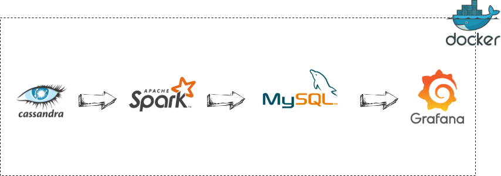
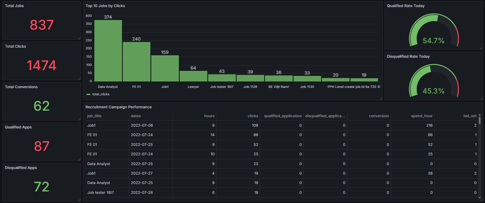

# <p align="center"> 🚀 Near Realtime Job Tracking Pipeline </p>

This project is a **near real-time data pipeline** (~2-second interval for 50 records) that tracks recruitment campaign performance. It implements a **custom Change Data Capture (CDC)** workflow that captures incremental changes from **Cassandra** and streams them into **Kafka**, where **Apache Spark Structured Streaming** consumes, processes, and transforms the data before loading it into **MySQL** (Data Warehouse). The processed performance metrics are visualized on **Grafana** dashboards for immediate monitoring and optimization of recruitment campaigns. The entire system is fully **containerized with Docker**, ensuring consistent, automated, and easily portable deployment across environments.

---


## 🛠️ Tech Stack

| Component | Description |
| :--- | :--- |
| **Cassandra** | Serves as a **Data Lake** for storing raw, high-velocity campaign event data. |
| **Kafka** | Streams changes captured from Cassandra to downstream processing. |
| **Spark** | Performs **real-time ETL processing**, aggregating and transforming data for analysis. |
| **MySQL** | Acts as a **Data Warehouse** for structured storage and querying. |
| **Grafana** | Provides **near real-time dashboards** and visualizations. |
| **Docker** | **Containerizes** the system for easy deployment, scaling, and orchestration. |

---

## 🗂️ Project Structure

```plaintext
Near-Realtime-Job-Tracking-Pipeline/
├── cdc_producer
│   ├── Dockerfile
│   └── producer.py
├── config
│   ├── cassandra_init.sh
│   ├── cassandra_schema.cql
│   └── mysql_schema.sql
├── spark_processor
│   ├── Dockerfile
│   └── ETL_script.py
├── docker-compose.yml
└── README.md
```

---

## 🔄 ETL Flow

This pipeline uses a custom CDC approach to process recruitment data from **Cassandra** to **MySQL** in near real-time.

### 1. Extract (Custom CDC)
* **Polling:** A custom **Python script** continuously scans **Cassandra** for new records using the timestamp (`ts`).
* **Streaming:** It detects new events and pushes them as JSON messages to a **Kafka** topic.
* **Efficiency:** The script runs every 0.5 seconds, capturing data almost instantly.

### 2. Transform (Spark Streaming)
* **Ingestion:** **Apache Spark** reads the raw data stream from **Kafka**.
* **Processing:**
    * **Aggregation:** Calculates `clicks`, `spend`, and `applications` (qualified/disqualified).
    * **Grouping:** Organizes data by Job ID, Campaign, and Hour.
* **Enrichment:** Joins the stream with **MySQL** to add Company details to the final dataset.

### 3. Load
* **Storage:** The processed data is written to **MySQL** in **append mode**.
* **Result:** Structured, analytics-ready data is immediately available for **Grafana** dashboards.

### ⚡ Highlights
* **Custom Polling:** Lightweight Python solution acting as CDC.
* **Real-time:** Data moves from source to dashboard in seconds.
* **Scalable:** Fully containerized using **Docker**.



---

## 📈 Data Schemas (MySQL Output)

| Column | Data Type | Description |
| :--- | :--- | :--- |
| **id** | INT | Surrogate Key. A unique, auto-generated ID for the record (internal tracking). |
| **job_id** | INT | The unique identifier for the job or recruitment posting. |
| **dates** | DATE | The date on which this performance data was recorded. |
| **hours** | INT | The hour block during which this performance data was recorded. |
| **disqualified_application** | INT | The number of applications that were disqualified/did not meet the minimum requirements. |
| **qualified_application** | INT | The number of applications that were deemed qualified after initial screening. |
| **conversion** | INT | The number of candidates that resulted in a final conversion (e.g., successful hire). |
| **company_id** | INT | The unique identifier of the company owning the job posting. |
| **group_id** | INT | The identifier for the group or department related to the job posting (often used for classification or aggregation). |
| **campaign_id** | INT | The unique identifier for the recruitment advertising/marketing campaign. |
| **publisher_id** | INT | The identifier for the advertising vendor or source (e.g., Google Ads, Job Board A). |
| **bid_set** | DOUBLE | The amount of money paid for each click generated by the campaign or job posting. |
| **clicks** | INT | The total number of times users clicked on the ad or job posting. |
| **spend_hour** | DOUBLE | The total cost spent on the campaign or job posting in 1 hour. |
| **sources** | VARCHAR | The technical origin of the data (e.g., Cassandra, Log File). |
| **updated_at** | TIMESTAMP | The timestamp indicating the last time this record was updated in the system. |

### Sample Output:

| id | job_id | dates | hours | disqualified_application | qualified_application | conversion | company_id | group_id | campaign_id | publisher_id | bid_set | clicks | spend_hour | sources | updated_at |
| :--- | :--- | :--- | :--- | :--- | :--- | :--- | :--- | :--- | :--- | :--- | :--- | :--- | :--- | :--- | :--- |
| 1001 | 2050 | 2025-10-01 | 10 | 5 | 20 | 3 | 1 | 45 | 301 | 15 | 0.50 | 120 | 60.00 | Cassandra | 2025-10-01 11:00:00 |
| 1002 | 2051 | 2025-10-01 | 11 | 2 | 10 | 0 | 1 | 45 | 302 | 15 | 0.00 | 350 | 0.00 | Cassandra | 2025-10-01 12:00:00 |
| 1003 | 2052 | 2025-10-02 | 14 | 0 | 5 | 1 | 2 | 50 | 405 | 22 | 1.25 | 40 | 50.00 | Cassandra | 2025-10-02 15:00:00 |
| 1004 | 2053 | 2025-10-02 | 15 | 15 | 50 | 5 | 1 | 48 | 301 | 15 | 0.75 | 250 | 187.50 | Cassandra | 2025-10-02 16:00:00 |

---

## 📊 Grafana Dashboard



---

## 📞 Contact

* 👨‍💻 Author: Phan Anh Tuan
* 📧 Email: tuandte27@gmail.com
* 🐙 GitHub: [tuandte27](https://github.com/tuandte27)